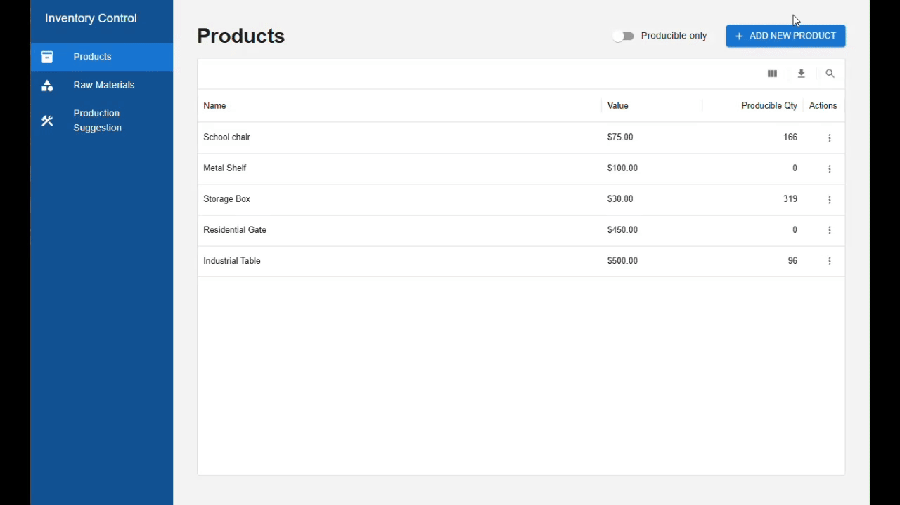

# Inventory Management System



## About the Project

- Simple Inventory Management System
- Backend built with Java and Quarkus
- Frontend built with React and TypeScript
- Database running with Docker (MySQL)
- Manages products and raw materials
- Controls stock and production availability

---

## Business Relationship

- A Product can depend on one or more Raw Materials
- Stock is controlled at the Raw Material level
- The system calculates how many products can be produced based on available raw material stock

### Example

- Product: Concrete Block
- Raw Material: Cement
- Relationship: 1 Concrete Block = 2 units of Cement

If there are 100 units of Cement in stock:

- It is possible to produce 50 Concrete Blocks

---

## How to Run the Project

### 1. Start the Database

- Navigate to the `database` folder
- Run:

```bash
docker compose up -d
```

### 2. Start the Backend

- Navigate to the backend folder:

```bash
cd inventory-backend
```

- Run:

```bash
.\mvnw.cmd quarkus:dev
```

- The backend will start in development mode

### 3. Start the Frontend

- Navigate to the frontend folder:

```bash
cd inventory-frontend
```

- Install dependencies:

```bash
pnpm install
```

- Run the development server:

```bash
pnpm run dev
```

- The frontend will start in development mode

---

## Running Tests

### Frontend

```bash
pnpm test
```

or

```bash
pnpm run test:run
```

### Backend

Inside `inventory-backend`:

```bash
.\mvnw.cmd test
```

---

## Project Structure

```
inventory/
│
├── database/
├── inventory-backend/
└── inventory-frontend/
```

---

## Technologies Used

### Backend

- Java
- Quarkus
- Hibernate ORM
- REST API
- MySQL

### Frontend

- React
- TypeScript
- Vite
- React Query
- Material UI
- Axios
- React Hook Form
- Zod
- Vitest
